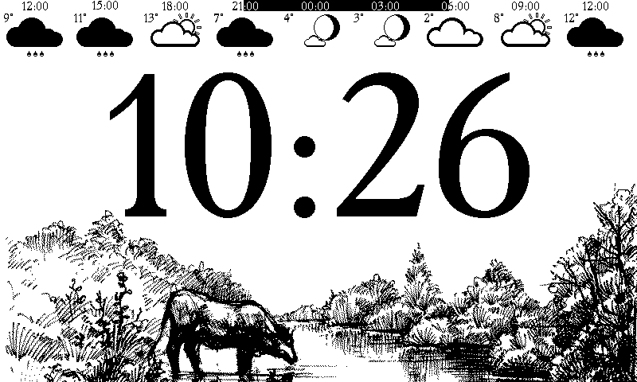

# epaper-weather-app

### Hardware requirements
 - Raspberry Pi
 - Waveshare E-Ink 7.5" 800x480

### Software requirements
 - Python
 - Pillow

### Image requirements

 - Size: 800 x 250
 - Name: ```<month>_<day>_<comments>.png```


